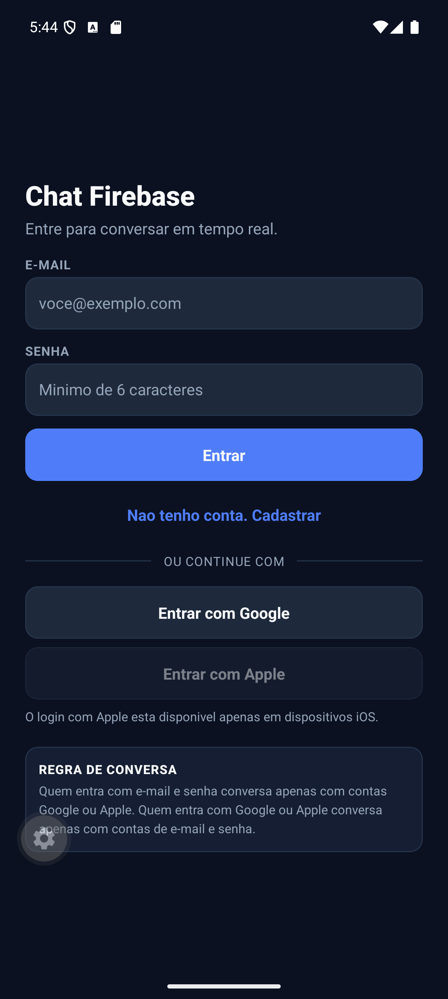
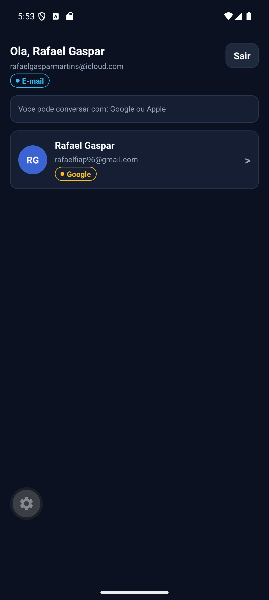
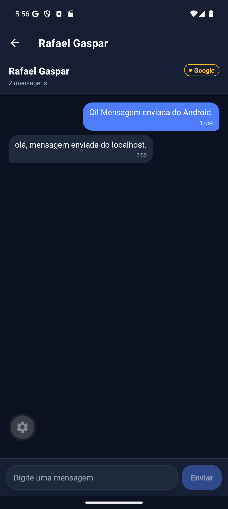

# Chat Firebase — Authentication + Realtime Database

Aplicativo de chat **1 para 1** em React Native + Expo + TypeScript, com autenticação por
**E-mail/Senha, Google e Apple** (Firebase Authentication) e mensagens sincronizadas em
**tempo real** pelo **Firebase Realtime Database**.

> **Cloud Firestore não é utilizado em nenhum ponto do projeto.** Toda a persistência de
> usuários, conversas e mensagens acontece no Realtime Database.

---

## Integrantes

> ⚠️ **PREENCHER ANTES DE ENTREGAR.** O trabalho recebe nota ZERO se esta seção não contiver
> o nome completo e o RM de todos os integrantes (máximo de 5).

- RM00000 - Nome Completo do Integrante 1
- RM00000 - Nome Completo do Integrante 2
- RM00000 - Nome Completo do Integrante 3
- RM00000 - Nome Completo do Integrante 4
- RM00000 - Nome Completo do Integrante 5

---

## Descrição

O usuário se autentica por um dos três provedores. A partir daí, a **forma de autenticação
define com quem ele pode conversar**:

```
E-mail/Senha ──── conversa com ────► Google  ou  Apple
Google        ──── conversa com ────► E-mail/Senha
Apple         ──── conversa com ────► E-mail/Senha
```

### Matriz de combinações

| Provedor A   | Provedor B   | Permitido |
| ------------ | ------------ | :-------: |
| E-mail/Senha | Google       |    ✅     |
| E-mail/Senha | Apple        |    ✅     |
| E-mail/Senha | E-mail/Senha |    ❌     |
| Google       | Google       |    ❌     |
| Apple        | Apple        |    ❌     |
| Google       | Apple        |    ❌     |

A regra se resume a: **exatamente um dos dois lados precisa ser `password`**. Ela está
implementada em [`src/utils/chatRules.ts`](src/utils/chatRules.ts) e é aplicada em três camadas:

1. **Consulta** — a lista de contatos só busca no Realtime Database os provedores compatíveis
   (`orderByChild('provider').equalTo(...)`).
2. **Interface** — os contatos passam por uma segunda filtragem antes de serem renderizados, e
   o próprio usuário nunca aparece na lista.
3. **Regras de segurança** — a criação da conversa só é aceita pelo servidor se os provedores
   dos dois participantes satisfizerem a regra.

---

## Tecnologias utilizadas

| Tecnologia                    | Versão      |
| ----------------------------- | ----------- |
| Expo SDK                      | **57**      |
| React Native                  | 0.86.3      |
| React                         | 19.2.3      |
| TypeScript                    | 6.0.3       |
| Firebase JS SDK               | 12.x        |
| React Navigation (Native Stack) | 7.x       |
| expo-auth-session             | 57.x        |
| expo-apple-authentication     | 57.x        |
| expo-crypto                   | 57.x        |
| @react-native-async-storage/async-storage | 2.2.0 |

### Serviços Firebase utilizados

- **Firebase Authentication** — cadastro, login (E-mail/Senha, Google, Apple), confirmação de
  e-mail por link, logout e identificação do usuário pelo `uid`.
- **Firebase Realtime Database** — armazenamento de usuários, conversas e mensagens, além da
  sincronização em tempo real via listeners (`onChildAdded` / `onValue`).

---

## Plataformas

| Plataforma | E-mail/Senha | Google | Apple |
| ---------- | :----------: | :----: | :---: |
| Android    |      ✅      |   ✅   |  n/d  |
| iOS        |      ✅      |   ✅   |  ✅   |
| Web        |      ✅      |   ✅   |  n/d  |

O Sign in with Apple é uma API nativa da Apple e só existe em iOS 13+. Nas demais plataformas o
botão continua visível, porém desabilitado e com a justificativa exibida na tela — como pede o
enunciado ("respeitar a disponibilidade de cada plataforma").

---

## Instruções para execução

### 1. Pré-requisitos

- Node.js 20 ou superior
- Um projeto no [Firebase Console](https://console.firebase.google.com/)
- Expo Go (Android/iOS) ou um development build

### 2. Instalar as dependências

```bash
npm install
```

### 3. Configurar as variáveis de ambiente

```bash
cp .env.example .env
```

Preencha o `.env` com os dados do seu projeto (ver a seção seguinte). **Enquanto o `.env` não
estiver completo, o app abre uma tela de configuração explicando exatamente o que falta**, em vez
de quebrar.

### 4. Rodar

```bash
npm start        # escolha a plataforma no menu do Expo
npm run android
npm run ios
npm run web
```

Depois de alterar o `.env`, reinicie com cache limpo:

```bash
npx expo start --clear
```

### 5. Conferir a tipagem

```bash
npm run typecheck
```

---

## Configuração do Firebase

### 5.1 Criar o projeto e o app Web

1. Firebase Console → **Adicionar projeto**.
2. Dentro do projeto → **Configurações do projeto** → **Seus apps** → ícone **Web (`</>`)**.
3. Copie os valores de `firebaseConfig` para o `.env`:

```env
EXPO_PUBLIC_FIREBASE_API_KEY=...
EXPO_PUBLIC_FIREBASE_AUTH_DOMAIN=seu-projeto.firebaseapp.com
EXPO_PUBLIC_FIREBASE_DATABASE_URL=https://seu-projeto-default-rtdb.firebaseio.com
EXPO_PUBLIC_FIREBASE_PROJECT_ID=seu-projeto
EXPO_PUBLIC_FIREBASE_STORAGE_BUCKET=seu-projeto.appspot.com
EXPO_PUBLIC_FIREBASE_MESSAGING_SENDER_ID=...
EXPO_PUBLIC_FIREBASE_APP_ID=...
```

### 5.2 Habilitar os provedores de autenticação

**Authentication → Sign-in method**, habilite:

- **E-mail/senha**
- **Google**
- **Apple**

### 5.3 Criar o Realtime Database

**Build → Realtime Database → Criar banco de dados**. Copie a URL gerada para
`EXPO_PUBLIC_FIREBASE_DATABASE_URL`.

### 5.4 Publicar as regras de segurança

Copie o conteúdo de [`database.rules.json`](database.rules.json) para a aba **Regras** do
Realtime Database e publique. O banco **não** fica aberto em momento algum — a raiz é negada por
padrão (`".read": false` / `".write": false`).

### 5.5 Google Sign-In

**Google Cloud Console → APIs e serviços → Credenciais → Criar credenciais → ID do cliente OAuth**.
Crie um client para cada plataforma que for usar e preencha:

```env
EXPO_PUBLIC_GOOGLE_WEB_CLIENT_ID=...
EXPO_PUBLIC_GOOGLE_IOS_CLIENT_ID=...
EXPO_PUBLIC_GOOGLE_ANDROID_CLIENT_ID=...
```

- O **iOS client** usa o bundle identifier `com.fiap.cpmobile.chat`.
- O **Android client** usa o package `com.fiap.cpmobile.chat` + a SHA-1 do keystore de debug.
- No **Expo Go** o redirect é um URI do próprio Expo; para o fluxo nativo completo, use um
  development build (`npx expo run:android` / `npx expo run:ios`).
- Se nenhum client ID for informado, o botão do Google aparece desabilitado com a instrução na
  tela — nada quebra.

### 5.6 Apple Sign-In

1. Apple Developer → **Certificates, Identifiers & Profiles** → habilite **Sign in with Apple**
   para o App ID `com.fiap.cpmobile.chat`.
2. Firebase Console → Authentication → Apple → informe **Services ID**, **Team ID**, **Key ID** e
   a chave `.p8`.
3. O app já declara `ios.usesAppleSignIn: true` e o plugin `expo-apple-authentication` no
   [`app.json`](app.json). É necessário um **development build** (o Expo Go não assina com o seu
   App ID).

O `nonce` é gerado no cliente: a Apple recebe o **SHA-256** do valor e o Firebase recebe o
**valor bruto** — é assim que o backend confirma que o token não foi reutilizado.

---

## Estrutura do projeto

```
CP-Mobile/
├── App.tsx                       # Providers + escolha entre Setup e Navegação
├── index.ts                      # Entry point do Expo
├── app.json                      # scheme, bundleId, package, plugins
├── database.rules.json           # Regras de segurança do Realtime Database
├── .env.example                  # Modelo das variáveis de ambiente
└── src/
    ├── components/               # Componentes reutilizáveis
    │   ├── ChatInput.tsx         #   campo de digitação + botão enviar
    │   ├── ChatMessage.tsx       #   balão de mensagem (enviada x recebida)
    │   ├── EmptyState.tsx        #   estado vazio
    │   ├── ErrorMessage.tsx      #   feedback de erro
    │   ├── Loading.tsx           #   indicador de carregamento
    │   ├── PrimaryButton.tsx     #   botão com loading/disabled
    │   ├── ProviderBadge.tsx     #   selo do provedor de autenticação
    │   ├── TextField.tsx         #   campo de texto rotulado
    │   └── UserItem.tsx          #   linha da lista de contatos
    ├── config/
    │   └── firebaseConfig.ts     # Leitura e validação das variáveis EXPO_PUBLIC_*
    ├── contexts/
    │   └── AuthContext.tsx       # Estado global da sessão
    ├── hooks/
    │   ├── useAppleSignIn.ts     # Fluxo Apple (nonce + credencial Firebase)
    │   ├── useAuth.ts            # Acesso tipado ao AuthContext
    │   ├── useChat.ts            # Mensagens em tempo real + envio
    │   ├── useContacts.ts        # Contatos compatíveis em tempo real
    │   └── useGoogleSignIn.ts    # Fluxo Google (expo-auth-session)
    ├── navigation/
    │   └── RootNavigator.tsx     # Stack condicionado à sessão
    ├── screens/
    │   ├── ChatScreen.tsx        # Conversa 1 para 1
    │   ├── LoginScreen.tsx       # Login, cadastro, Google e Apple
    │   ├── SetupScreen.tsx       # Instruções quando o .env está incompleto
    │   ├── UsersScreen.tsx       # Lista de contatos + logout
    │   └── VerifyEmailScreen.tsx # Barreira de confirmação de e-mail
    ├── services/                 # Toda a comunicação com o Firebase
    │   ├── authService.ts        #   cadastro, logins, logout, observer
    │   ├── chatService.ts        #   conversa, envio e listeners de mensagens
    │   ├── firebase.ts           #   inicialização de App, Auth e Database
    │   └── userService.ts        #   perfil e busca de contatos compatíveis
    ├── theme/
    │   └── theme.ts              # Cores, espaçamentos, raios e tipografia
    ├── types/
    │   ├── chat.ts               # Conversation, ChatMessage
    │   ├── firebase-auth.d.ts    # Tipagem de getReactNativePersistence
    │   ├── navigation.ts         # RootStackParamList
    │   └── user.ts               # AuthProvider, ChatUser
    └── utils/
        ├── chatRules.ts          # Regra entre provedores + id da conversa
        └── errors.ts             # Tradução de erros do Firebase para pt-BR
```

---

## Confirmação de e-mail

Contas criadas com **e-mail e senha** passam por uma etapa de confirmação antes de acessar o chat:

```
Cadastro (nome, e-mail, senha, confirmar senha)
          ↓
  sendEmailVerification()  →  Firebase envia o link
          ↓
  VerifyEmailScreen  (o chat fica bloqueado aqui)
          ↓
  usuário abre o link  →  toca em "Já confirmei"
          ↓
  reload() confirma emailVerified  →  perfil vai para o Realtime Database
          ↓
  Lista de contatos liberada
```

Detalhes da implementação:

- O campo **Confirmar senha** valida no cliente antes de chamar o Firebase.
- **Google e Apple não passam por esta etapa** — os provedores já entregam o e-mail verificado.
  A regra está em `requiresEmailVerification()`, em [`authService.ts`](src/services/authService.ts).
- O **perfil só é publicado** em `users/{uid}` depois da confirmação, então contas não
  verificadas **não aparecem na lista de contatos de ninguém**.
- `onAuthStateChanged` não dispara quando o link é aberto em outro dispositivo, por isso a
  tela oferece o botão **"Já confirmei"**, que chama `reload()` explicitamente, e o
  **"Reenviar e-mail"**.

---

## Modelo de dados no Realtime Database

```
users
  └── {uid}
       ├── uid: string
       ├── name: string
       ├── email: string | null
       ├── provider: "password" | "google" | "apple"
       ├── createdAt: number
       └── updatedAt: number

conversations
  └── {conversationId}            # "{uidMenor}_{uidMaior}"
       ├── id: string
       ├── participants: [uidA, uidB]   # exatamente 2
       └── createdAt: number

messages
  └── {conversationId}
       └── {messageId}
            ├── id: string
            ├── conversationId: string
            ├── senderId: string
            ├── receiverId: string
            ├── text: string
            └── createdAt: number
```

O `conversationId` é **determinístico**: os dois `uid` são ordenados e unidos por `_`. Isso
garante que os dois lados sempre cheguem à mesma conversa, independentemente de quem iniciou, e
permite que as regras de segurança validem o vínculo entre o id e os participantes sem consultas
extras.

---

## Segurança

O arquivo [`database.rules.json`](database.rules.json) implementa:

- **Raiz negada por padrão** (`".read": false`, `".write": false`).
- `users` — leitura apenas para autenticados; escrita apenas do próprio perfil
  (`auth.uid === $uid`), com validação de tipo e de valor de cada campo.
- `conversations/{id}` — leitura e escrita apenas para quem é participante do id; a conversa é
  **imutável** após criada (`!data.exists()`); a validação exige **exatamente 2 participantes**,
  que o id corresponda aos uids e que **os provedores satisfaçam a regra do trabalho**.
- `messages/{conversationId}` — leitura apenas para os participantes; cada mensagem só pode ser
  criada pelo próprio remetente (`senderId === auth.uid`), exige que a conversa exista, que
  remetente e destinatário sejam os participantes registrados e que o texto tenha entre 1 e 1000
  caracteres. Mensagens não podem ser editadas nem apagadas.
- `.indexOn` em `users` (`provider`) e em `messages/{conversationId}` (`createdAt`) para as
  consultas ordenadas.

---

## Atualização em tempo real

```
Usuário A envia mensagem
          ↓
  chatService.sendMessage()  →  Realtime Database
          ↓
  onChildAdded (listener ativo nos dois lados)
          ↓
  useChat → setMessages((previous) => [...previous, novaMensagem])
          ↓
  Tela atualiza sozinha — sem refresh, sem botão, sem reabrir o chat
```

O texto digitado só é limpo **depois** que o Realtime Database confirma a gravação, e a mensagem
aparece na lista pelo próprio listener — ou seja, o banco é a única fonte da verdade e nada é
simulado localmente.

**Remoção de listeners:** `subscribeToMessages` e `subscribeToCompatibleUsers` retornam a função
de cancelamento, devolvida diretamente no `return` do `useEffect`. Ao sair do chat, trocar de
conversa ou fazer logout, todos os listeners são removidos.

---

## Hooks obrigatórios

| Hook          | Onde                                        | Para quê |
| ------------- | ------------------------------------------- | -------- |
| `useState`    | telas, `useChat`, `useContacts`, `AuthContext` | formulários, mensagens, contatos, loading e erro |
| `useEffect`   | `AuthContext`, `useChat`, `useContacts`, `useGoogleSignIn`, `useAppleSignIn`, `ChatScreen` | listeners do Firebase, resposta do OAuth, título da tela — todos com cleanup |
| `useMemo`     | `AuthContext`, `useContacts`, `useChat`, `LoginScreen`, `UsersScreen`, `ChatScreen` | valor do contexto, filtragem dos contatos, mensagem de erro unificada, rótulos derivados |
| `useCallback` | todas as telas, hooks e `UserItem`          | handlers estáveis passados a `FlatList`, `Pressable` e componentes filhos |

---

## TypeScript

- `strict: true` habilitado.
- **Zero ocorrências de `any`**, `@ts-ignore` ou `@ts-expect-error` em todo o `src/`.
- Dados vindos do Firebase são tratados como `unknown` e validados por type guards
  (`parseChatUser`, `parseChatMessage`, `isAuthProvider`) antes de virarem modelos de domínio.
- Blocos `catch` usam `unknown` e passam por `translateError`.
- `Conversation.participants` é a tupla `[string, string]` — o tipo já impede uma conversa com
  três ou mais pessoas.
- `src/types/firebase-auth.d.ts` declara `getReactNativePersistence`, que existe no entry point
  React Native do `@firebase/auth` mas não é publicado nas tipagens do bundle browser — assim a
  persistência da sessão funciona sem recorrer a `any`.

### Imutabilidade

Todas as atualizações de estado criam um novo valor:

```ts
setMessages((previous) => [...previous, newMessage]);
```

---

## Estados tratados na interface

| Estado                        | Onde aparece |
| ----------------------------- | ------------ |
| Loading da sessão             | `RootNavigator` — "Verificando sua sessão..." |
| Loading da autenticação       | Botões de login/cadastro/Google/Apple |
| Loading dos contatos          | `UsersScreen` |
| Loading das mensagens         | `ChatScreen` |
| Usuário não autenticado       | Stack só monta `LoginScreen` |
| Credenciais inválidas         | `ErrorMessage` no topo do formulário |
| Nenhum contato disponível     | `EmptyState` explicando a regra de provedores |
| Conversa sem mensagens        | `EmptyState` convidando a enviar a primeira |
| Falha no envio                | `ErrorMessage` no chat + o texto digitado é preservado |
| Falha de conectividade        | Mensagem traduzida (`auth/network-request-failed`) |
| Senhas não conferem           | `ErrorMessage` no campo "Confirmar senha" |
| E-mail não confirmado         | `VerifyEmailScreen` com reenvio do link |
| Firebase não configurado      | `SetupScreen` listando as variáveis ausentes |

---

## Logout

`signOut()` encerra a sessão no Firebase, limpa o `user` do estado e, como o stack de navegação é
condicionado a `user`, as telas autenticadas são **desmontadas** — junto com todos os listeners do
Realtime Database. Não há como voltar ao chat sem autenticar novamente.

---

## Prints da aplicação

> ⚠️ **PREENCHER ANTES DE ENTREGAR.** Coloque as capturas em `docs/prints/` e ajuste os caminhos.

| Login | Contatos | Chat |
| ----- | -------- | ---- |
|  |  |  |

Sugestão de capturas adicionais:

- Cadastro com e-mail e senha
- Mensagem de erro de credencial inválida
- Lista de contatos vazia (regra de provedores)
- Conversa sem mensagens
- Regras publicadas no Console do Firebase

---

## Como testar a regra entre provedores

1. Crie uma conta com **e-mail e senha** no dispositivo A.
2. Entre com **Google** (ou **Apple**, no iOS) no dispositivo B.
3. Em ambos, a lista de contatos mostra **apenas** o outro usuário.
4. Abra a conversa e envie mensagens — elas aparecem nos dois lados instantaneamente.
5. Crie uma **segunda** conta de e-mail/senha: ela **não** aparece para a primeira conta de
   e-mail/senha, porque a combinação `password ↔ password` não é permitida.
